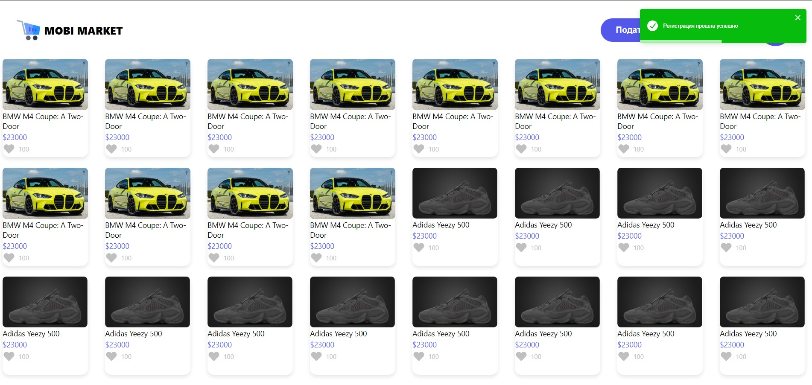

# Marketplace Web Application

This web application serves as a marketplace platform allowing users to register, log in, manage their profile, and interact by adding and selling products.

## Features

- **Registration Page**: Users can sign up for a new account providing required information.

  
  
  

- **Login Page**: Registered users can log in using their credentials.

  

- **Main Page**: Users can view available products and add their own products for sale.

  

- **Product adding**: Authorized user can add products to sell

  

- **Profile Page**: Users can manage their personal information, including name, last name, date of birth, and phone number.

  

## Usage

1. **Registration and Login**:

   - Navigate to the registration page to create a new account.
   - Use the credentials to log in through the login page.

2. **Main Page**:

   - After logging in, users can access the main page.
   - Users can view available products and add their products for sale.

3. **Profile Page**:
   - Access the profile page to manage personal information.
   - Update details such as name, last name, date of birth, and phone number.

## Technologies Used

- React.js: Frontend framework for building user interfaces.
- HTML/CSS: For web page structure and styling.
- JavaScript: Programming language for frontend.
- React Toastify: Package to add notifications in React
- Redux toolkit: opinionated, batteries-included toolset for efficient Redux development.
- Axios: HTTP library to make requests to server to fetch data

## Setup and Installation

1. Clone the repository:

   ```
   git clone https://github.com/yourusername/marketplace.git
   cd marketplace
   ```

2. Install dependencies:

   ```
   npm install
   ```

3. Start the application:

   ```
   npm start
   ```

## Contributors

- Aibek Yrysbekov (backend): https://github.com/AibekYrysbekov
- Igor Pak (IOS): https://github.com/iPakTulane
- Venera Omurzak kyzy (frontend): https://github.com/Venera00
